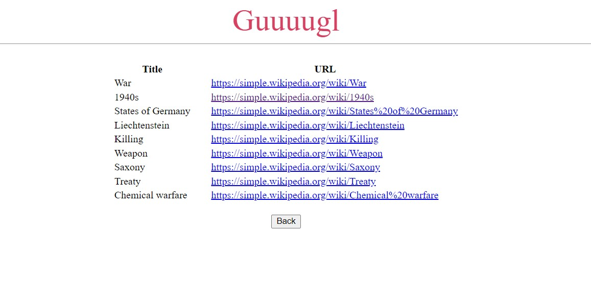

### Pierwsze uruchomienie
`pip install -r requirements.txt` \
`python download_data.py` - pobiera data set\
`python searcher.py` - generuje macierz i słownik

### Uruchomienie aplikacji
`run flask`

- Do frontendu użyłem html'a. Biblioteka Flask posłużyła do postawienia strony. 
- Przygotowałem 1000 arytkułów za pomocą  `load_dataset` z biblioteki `datasets`
- Do usuwania szumu użyłem `scipy.sparse.linalg.svds`
- Funkcja `lemmatize` z biblioteki `nltk` sprowadza słowa do postawowej formy, dzięki temu słownik
jest znacznie mniejszy
- W wersji z usuwaniem szumu dla 1000 artykułów wyniki nie różniły się znacznie, może się wydawać, że ze wzrostem argumetnu k wyniki są lepsze.

